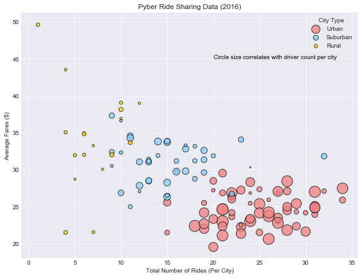
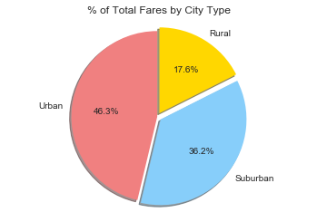
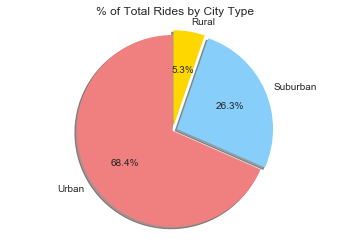

```python
import matplotlib.pyplot as plt
import numpy as np
import pandas as pd
```


```python
citycsv = "raw_data/city_data.csv"
ridecsv = "raw_data/ride_data.csv"
city_df = pd.read_csv(citycsv)
# clean duplicate rows in city data
clean_city_df = pd.DataFrame({"driver_count": city_df.groupby("city")["driver_count"].sum(),
                              'type': city_df.groupby('city').first()['type']    
                             })
clean_city_df.reset_index(inplace=True)
ride_df = pd.read_csv(ridecsv)
```


```python
# merge city and ride date into one dataframe
city_ride_df = pd.DataFrame({"Fares": ride_df.groupby("city")["fare"].mean(),
                             "Rides": ride_df.groupby("city")["ride_id"].count()   
                             })
city_ride_df.reset_index(inplace=True)
city_ride_df = pd.merge(city_ride_df,clean_city_df,on="city")
city_ride_df.head()
```


<div>
<style>
    .dataframe thead tr:only-child th {
        text-align: right;
    }

    .dataframe thead th {
        text-align: left;
    }

    .dataframe tbody tr th {
        vertical-align: top;
    }
</style>
<table border="1" class="dataframe">
  <thead>
    <tr style="text-align: right;">
      <th></th>
      <th>city</th>
      <th>Fares</th>
      <th>Rides</th>
      <th>driver_count</th>
      <th>type</th>
    </tr>
  </thead>
  <tbody>
    <tr>
      <th>0</th>
      <td>Alvarezhaven</td>
      <td>23.928710</td>
      <td>31</td>
      <td>21</td>
      <td>Urban</td>
    </tr>
    <tr>
      <th>1</th>
      <td>Alyssaberg</td>
      <td>20.609615</td>
      <td>26</td>
      <td>67</td>
      <td>Urban</td>
    </tr>
    <tr>
      <th>2</th>
      <td>Anitamouth</td>
      <td>37.315556</td>
      <td>9</td>
      <td>16</td>
      <td>Suburban</td>
    </tr>
    <tr>
      <th>3</th>
      <td>Antoniomouth</td>
      <td>23.625000</td>
      <td>22</td>
      <td>21</td>
      <td>Urban</td>
    </tr>
    <tr>
      <th>4</th>
      <td>Aprilchester</td>
      <td>21.981579</td>
      <td>19</td>
      <td>49</td>
      <td>Urban</td>
    </tr>
  </tbody>
</table>
</div>


```python
# create a color dataframe to reference three city type
color_df = pd.DataFrame({"type":["Urban","Suburban","Rural"],
                         "color": ["lightcoral","lightskyblue", "gold"]    
                         })
color_df = color_df.set_index("color")
```


```python
# bubble plot that showcases relationship of fare, ride, driver, city type
plt.figure(figsize=(10,7.5))
plt.style.use('seaborn-darkgrid')
for color in color_df.index.values.tolist():    
    plt.scatter(x=city_ride_df.loc[city_ride_df["type"]==color_df.loc[color,"type"],:]["Rides"], 
                y=city_ride_df.loc[city_ride_df["type"]==color_df.loc[color,"type"],:]["Fares"], 
                s=city_ride_df.loc[city_ride_df["type"]==color_df.loc[color,"type"],:]["driver_count"]*5, 
                color=color, label=color_df.loc[color,"type"],alpha=0.75,edgecolor="black",linewidths=1)
plt.legend(title="City Type")
plt.title("Pyber Ride Sharing Data (2016)")
plt.xlabel("Total Number of Rides (Per City)")
plt.ylabel("Average Fares ($)")
plt.text(20, 45, "Circle size correlates with driver count per city", color="black")
plt.show()
```





```python
# pie chart showing % of Total Fares by City Type
city_type = ["Urban", "Suburban", "Rural"]
fares = city_ride_df.groupby("type").sum()["Fares"]
fares_list = [fares["Urban"],fares["Suburban"],fares["Rural"]]
colors = ["lightcoral","lightskyblue", "gold"]
explode = (0, 0.05, 0.05)
plt.pie(fares_list, explode=explode, labels=city_type, colors=colors,
         autopct="%1.1f%%", shadow=True, startangle=90)
plt.title("% of Total Fares by City Type")
plt.axis("equal")
plt.show()
```





```python
# pie chart showing % of Total Rides by City Type
rides = city_ride_df.groupby("type").sum()["Rides"]
rides_list = [rides["Urban"],rides["Suburban"],rides["Rural"]]
plt.pie(rides_list, explode=explode, labels=city_type, colors=colors,
         autopct="%1.1f%%", shadow=True, startangle=90)
plt.title("% of Total Rides by City Type")
plt.axis("equal")
plt.show()
```





```python
# pie chart showing % of Total Drivers by City Type
drivers = city_ride_df.groupby("type").sum()["driver_count"]
drivers_list = [drivers["Urban"],drivers["Suburban"],drivers["Rural"]]
plt.pie(drivers_list, explode=explode, labels=city_type, colors=colors,
         autopct="%1.1f%%", shadow=True, startangle=90)
plt.title("% of Total Drivers by City Type")
plt.axis("equal")
plt.show()
```


